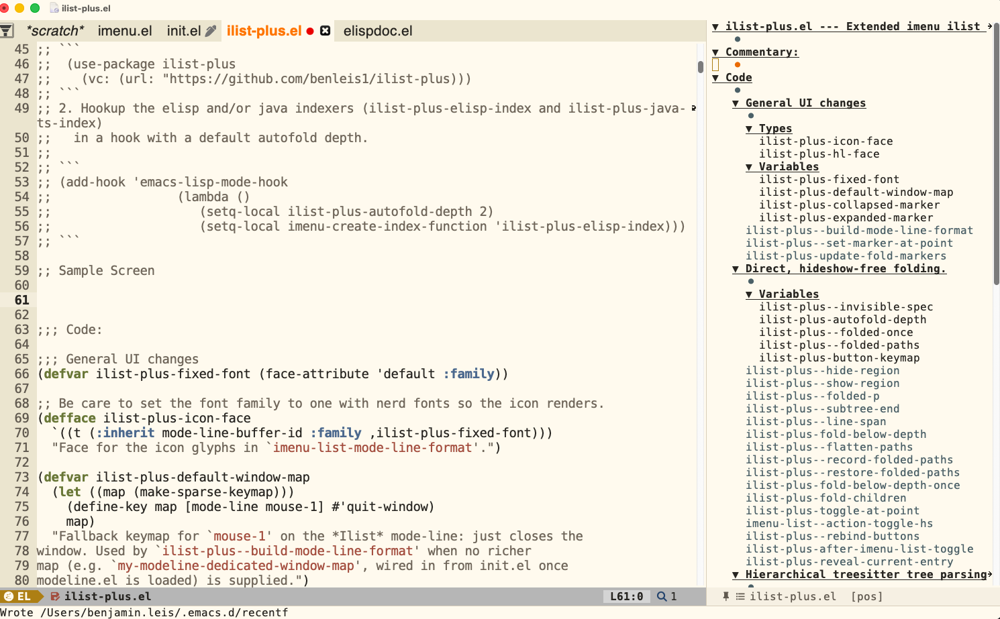

# ilist

# Commentary:

```
 o8o  oooo   o8o               .
 `"'  `888   `"'             .o8
oooo   888  oooo   .oooo.o .o888oo     88
`888   888  `888  d88(  "8   888       88
 888   888   888  `"Y88b.    888   8888888888
 888   888   888  o.  )88b   888 .     88
o888o o888o o888o 8""888P'   "888"     88
```

Copyright (C) 2026 Benjamin Leis

Author:  Benjamin Leis <benleis1@gmail.com>

Maintainer: Benjamin Leis <benleis1@gmail.com>

Version: 0.0.1

Package-Requires: ((emacs "29") (imenu-list "20210420.1200") (diff-hl "20260830.1400"))

Keywords: convenience outlines tools

URL: https://github.com/benleis1/ilist-plus

Imenu and imenu-list extensions  **BETA release**

Included here are all of the extensions off of Imenu-List
* Arrow icons
* sorting
* custom mode-line formatting
* fixes for highlighting even empty headers
* special handling for org mode
* custom indexing for elisp
* custom indexing for treesitter java mode

## Requirements
1. imenu-list package installed and loaded before imenu.el ((use-package imenu-list :ensure t))
2. Recommended: modus-themes loaded with a theme active — modus-themes-get-color-value is called
   at defface time for ilist-plus-hl-face and ilist-plus-modified-face.
3. Recommended: a fg-hl-imenu entry in modus-themes-common-palette-overrides — without it the
     highlight face has no foreground color.
4. diff-hl package + global-diff-hl-mode enabled, for the VC-modified highlighting to work

## Installing
1. Install this package using `use-package`
```
 (use-package ilist-plus
   :vc (:url "https://github.com/benleis1/ilist-plus"))
```
2. Hookup the elisp and/or java indexers (ilist-plus-elisp-index and ilist-plus-java-ts-index)
  in a hook with a default autofold depth.

```
(add-hook 'emacs-lisp-mode-hook
                (lambda ()
            	      (setq-local ilist-plus-autofold-depth 2)
                   (setq-local imenu-create-index-function 'ilist-plus-elisp-index)))
```

## Sample Screen


## Demo video
[Link](https://www.youtube.com/watch?v=NU2WcX4dDiU)

# Code:
<!-- markdown-toc start - Don't edit this section. Run M-x markdown-toc-refresh-toc -->
**Table of Contents**

- [ilist](#ilist)
- [Commentary:](#commentary)
  - [Requirements](#requirements)
  - [Installing](#installing)
  - [Sample Screen](#sample-screen)
  - [Demo video](#demo-video)
- [Code:](#code)
- [General UI changes](#general-ui-changes)
  - [ilist-plus--modus-color](#ilist-plus--modus-color)
  - [ilist-plus--build-mode-line-format](#ilist-plus--build-mode-line-format)
  - [ilist-plus--set-marker-at-point](#ilist-plus--set-marker-at-point)
  - [ilist-plus-update-fold-markers](#ilist-plus-update-fold-markers)
- [Direct, hideshow-free folding.](#direct-hideshow-free-folding)
  - [ilist-plus--hide-region](#ilist-plus--hide-region)
  - [ilist-plus--show-region](#ilist-plus--show-region)
  - [ilist-plus--folded-p](#ilist-plus--folded-p)
  - [ilist-plus--subtree-end](#ilist-plus--subtree-end)
  - [ilist-plus--line-span](#ilist-plus--line-span)
  - [ilist-plus-fold-below-depth](#ilist-plus-fold-below-depth)
  - [ilist-plus--flatten-paths](#ilist-plus--flatten-paths)
  - [ilist-plus--record-folded-paths](#ilist-plus--record-folded-paths)
  - [ilist-plus--restore-folded-paths](#ilist-plus--restore-folded-paths)
  - [ilist-plus-fold-below-depth-once](#ilist-plus-fold-below-depth-once)
  - [ilist-plus-fold-children](#ilist-plus-fold-children)
  - [ilist-plus-toggle-at-point](#ilist-plus-toggle-at-point)
  - [imenu-list--action-toggle-hs](#imenu-list--action-toggle-hs)
  - [ilist-plus--rebind-buttons](#ilist-plus--rebind-buttons)
  - [ilist-plus-after-imenu-list-toggle](#ilist-plus-after-imenu-list-toggle)
  - [ilist-plus-reveal-current-entry](#ilist-plus-reveal-current-entry)
- [Hierarchical treesitter tree parsing](#hierarchical-treesitter-tree-parsing)
  - [ilist-plus-make-marker](#ilist-plus-make-marker)
  - [ilist-plus-compare](#ilist-plus-compare)
  - [ilist-plus-current-sort](#ilist-plus-current-sort)
  - [ilist-plus-sort-advice](#ilist-plus-sort-advice)
  - [ilist-plus-sort-alphabetically](#ilist-plus-sort-alphabetically)
  - [ilist-plus-switch-sort](#ilist-plus-switch-sort)
- [Elisp custom header handling](#elisp-custom-header-handling)
  - [ilist-plus-elisp-flatten-raw](#ilist-plus-elisp-flatten-raw)
  - [ilist-plus-elisp-back-over-comments](#ilist-plus-elisp-back-over-comments)
  - [ilist-plus-elisp-parse-and-tag-ranges](#ilist-plus-elisp-parse-and-tag-ranges)
  - [ilist-plus-elisp-ranges](#ilist-plus-elisp-ranges)
  - [ilist-plus-elisp-find-section](#ilist-plus-elisp-find-section)
  - [ilist-plus-elisp-bucket-by-section](#ilist-plus-elisp-bucket-by-section)
  - [ilist-plus-elisp-nest-under-code](#ilist-plus-elisp-nest-under-code)
  - [ilist-plus-elisp-build-header](#ilist-plus-elisp-build-header)
  - [ilist-plus-elisp-index](#ilist-plus-elisp-index)
  - [ilist-plus-elisp-index-by-position](#ilist-plus-elisp-index-by-position)
  - [ilist-plus-elisp-index-by-type](#ilist-plus-elisp-index-by-type)
  - [ilist-plus--entry-position](#ilist-plus--entry-position)
  - [ilist-plus--current-entry](#ilist-plus--current-entry)
- [VC Highlighting](#vc-highlighting)
  - [ilist-plus--flatten-entries](#ilist-plus--flatten-entries)
  - [ilist-plus--section-modified-p](#ilist-plus--section-modified-p)
  - [ilist-plus--entry-range](#ilist-plus--entry-range)
  - [ilist-plus--mark-modified](#ilist-plus--mark-modified)
  - [ilist-plus-highlight-modified-entries](#ilist-plus-highlight-modified-entries)
- [Org mode optimization. Its not completely clear if its needed.](#org-mode-optimization-its-not-completely-clear-if-its-needed)
  - [ilist-plus--skip-org-rescan-if-unmodified](#ilist-plus--skip-org-rescan-if-unmodified)
- [ilist-plus.el ends here](#ilist-plusel-ends-here)

<!-- markdown-toc end -->

# General UI changes
```
(defgroup ilist-plus nil
  "Extended imenu-list support."
  :group 'convenience)

(defvar ilist-plus-fixed-font (face-attribute 'default :family))
```

Be care to set the font family to one with nerd fonts so the icon renders.
```
(defface ilist-plus-icon-face
  `((t (:inherit mode-line-buffer-id :family ,ilist-plus-fixed-font)))
  "Face for the icon glyphs in `imenu-list-mode-line-format'."
  :group 'ilist-plus)
```

## ilist-plus--modus-color
`modus-themes' is optional,
fall back to a plain color when it isn't loaded, since `defface' below
evaluates this at package-load time, not lazily.
```
(defun ilist-plus--modus-color (name overrides &optional fallback)
  (if (fboundp 'modus-themes-get-color-value)
      (modus-themes-get-color-value name overrides)
    (or fallback "black")))

(defvar ilist-plus-default-window-map
  (let ((map (make-sparse-keymap)))
    (define-key map [mode-line mouse-1] #'quit-window)
    map)
  "Fallback keymap for `mouse-1' on the *Ilist* mode-line: just closes the
window. Used by `ilist-plus--build-mode-line-format' when no richer
map (e.g. `my-modeline-dedicated-window-map', wired in from init.el once
modeline.el is loaded) is supplied.")
```

## ilist-plus--build-mode-line-format
>Build a value for `imenu-list-mode-line-format', using WINDOW-MAP
(default `ilist-plus-default-window-map') as the mode-line's local-map.

```
(defun ilist-plus--build-mode-line-format (&optional window-map)
  "Build a value for `imenu-list-mode-line-format', using WINDOW-MAP
\(default `ilist-plus-default-window-map') as the mode-line's local-map."
  `("%e"
    (:propertize
     ("" mode-line-frame-identification
      (:propertize "󰐃 󰉹" face ilist-plus-icon-face) " "
      (:eval (buffer-name imenu-list--displayed-buffer)) "  "
      (:eval (format "[%s]" (ilist-plus-current-sort imenu-list--displayed-buffer))) "  "
      mode-line-end-spaces)
     help-echo "mouse-1: close the window"
     mouse-face mode-line-highlight
     local-map ,(or window-map ilist-plus-default-window-map))))
```

Simplified buffer name with icon for the menu bar. Self-contained
default; init.el overrides this with the richer
`my-modeline-dedicated-window-map' once modeline.el has loaded.
```
(setq imenu-list-mode-line-format (ilist-plus--build-mode-line-format))

(defconst ilist-plus-collapsed-marker "▶"
  "Marker shown before a folded (hidden) imenu-list entry.")

(defconst ilist-plus-expanded-marker "▼"
  "Marker shown before an unfolded (visible) imenu-list entry.")
```

I need a more visible highlight for the current block
```
(defface ilist-plus-hl-face
  `((t (:foreground ,(ilist-plus--modus-color 'fg-hl-imenu t) :weight bold)))
  "A new custom face for highlighting."
  :group 'ilist-plus)
```

## ilist-plus--set-marker-at-point
>Make the fold marker on the current line display as an arrow
reflecting whether the block starting here is currently hidden.

```
(defun ilist-plus--set-marker-at-point ()
  "Make the fold marker on the current line display as an arrow
reflecting whether the block starting here is currently hidden."
  (save-excursion
    (beginning-of-line)
    (when (looking-at "^ *\\(\\+\\) ")
      (let ((inhibit-read-only t))
        (put-text-property (match-beginning 1) (match-end 1)
                           'display
                           ;; Our fold overlays start at the beginning of
                           ;; the *next* line (see `ilist-plus--line-span'),
                           (if (ilist-plus--folded-p (min (point-max) (1+ (line-end-position))))
                               ilist-plus-collapsed-marker
                             ilist-plus-expanded-marker))))))
```

## ilist-plus-update-fold-markers
>Update every foldable entry's marker in the *Ilist* buffer to
match its current hidden/shown state.

```
(defun ilist-plus-update-fold-markers ()
  "Update every foldable entry's marker in the *Ilist* buffer to
match its current hidden/shown state."
  (when (get-buffer imenu-list-buffer-name)
    (with-current-buffer imenu-list-buffer-name
      (ilist-plus--rebind-buttons)
      (save-excursion
        (goto-char (point-min))
        (while (not (eobp))
          (ilist-plus--set-marker-at-point)
          (forward-line 1))))))
```


# Direct, hideshow-free folding.
Emacs 31 rewrote hideshow.el, and its new engine has a reproducible
bug where hiding several blocks within one command silently fails
partway through, with no error -- confirmed across every hideshow
```
(defvar ilist-plus--invisible-spec 'ilist-plus-fold
  "Symbol used as the `invisible' overlay property for folded *Ilist* blocks.")
```

## ilist-plus--hide-region
>Fold BEG..END in the *Ilist* buffer via our own overlay.

```
(defun ilist-plus--hide-region (beg end)
  "Fold BEG..END in the *Ilist* buffer via our own overlay."
  (let ((ov (make-overlay beg end)))
    (overlay-put ov 'invisible ilist-plus--invisible-spec)
    (overlay-put ov 'ilist-plus-fold t)
    (overlay-put ov 'evaporate t)
    ov))
```

## ilist-plus--show-region
>Unfold BEG..END in the *Ilist* buffer.

```
(defun ilist-plus--show-region (beg end)
  "Unfold BEG..END in the *Ilist* buffer."
  (remove-overlays beg end 'ilist-plus-fold t))
```

## ilist-plus--folded-p
>Non-nil if our fold overlay covers POS.

```
(defun ilist-plus--folded-p (pos)
  "Non-nil if our fold overlay covers POS."
  (eq (get-char-property pos 'invisible) ilist-plus--invisible-spec))
```

## ilist-plus--subtree-end
>Index in FLAT (length N) of the first entry after START whose
depth is not greater than BASE-DEPTH -- i.e. the end of the subtree
rooted at START.

```
(defun ilist-plus--subtree-end (flat n start base-depth)
  "Index in FLAT (length N) of the first entry after START whose
depth is not greater than BASE-DEPTH -- i.e. the end of the subtree
rooted at START."
  (let ((i (1+ start)))
    (while (and (< i n) (> (1+ (cdr (nth i flat))) base-depth))
      (setq i (1+ i)))
    i))
```

## ilist-plus--line-span
>Character range to hide for the subtree at line I: from the start of
line I+1 (i.e. *after* I's own header line and its newline, so the
header keeps its own line break and stays on its own visual line) to
the start of line END-I (or `point-max' if END-I runs past the last
entry, of N total).

```
(defun ilist-plus--line-span (n i end-i)
  "Character range to hide for the subtree at line I: from the start of
line I+1 (i.e. *after* I's own header line and its newline, so the
header keeps its own line break and stays on its own visual line) to
the start of line END-I (or `point-max' if END-I runs past the last
entry, of N total)."
  (save-excursion
    (goto-char (point-min))
    (forward-line (1+ i))
    (let ((beg (point)))
      (cons beg (if (>= end-i n)
                    (point-max)
                  (goto-char (point-min))
                  (forward-line end-i)
                  (point))))))
```

Hook for setup of the mode,
```
(add-hook 'imenu-list-major-mode-hook
          (lambda ()
            ;; Wire in my custom highlight face.
            (setq-local face-remapping-alist '((hl-line ilist-plus-hl-face)))
            ;; High enough priority for this face so it takes precedence
            ;; unlike normal I don't want to preserve the underlying foreground color
            (setq-local hl-line-overlay-priority 10)
            ;; Setup the custom invisibility spec we use for folding.
            (add-to-invisibility-spec ilist-plus--invisible-spec)
            (setq-local line-move-ignore-invisible t)))
```

hideshow's own activation is no longer wanted we fold via our own overlays above instead.
```
(remove-hook 'imenu-list-major-mode-hook #'hs-minor-mode)
```

 Autofolding
```
(defvar-local ilist-plus-autofold-depth 2 "Initial depth to expand imenu-list window")
```

Track whether we've shown this buffer's imenu-list at least once, and
if so, which containers were folded the last time we looked -- both
are buffer-local to the *source* buffer (not the shared *Ilist*
buffer), so each buffer remembers its own fold state independently.
```
(defvar-local ilist-plus--folded-once nil
  "`ilist-plus-fold-below-depth' has folded this buffer's imenu-list.")

(defvar-local ilist-plus--folded-paths nil
  "Ancestor-name paths (see `ilist-plus--flatten-paths') of the
containers that were folded the last time this buffer's *Ilist* was
displayed. Restored by `ilist-plus--restore-folded-paths' whenever
the *Ilist* buffer is rebuilt for this buffer again.")
```

## ilist-plus-fold-below-depth
>Collapse imenu-list entries nested deeper than DEPTH (default
`ilist-plus-autofold-depth'). Top-level entries are depth 1.

```
(defun ilist-plus-fold-below-depth (&optional depth)
  "Collapse imenu-list entries nested deeper than DEPTH (default
`ilist-plus-autofold-depth'). Top-level entries are depth 1."
  (interactive)
  (let ((depth (or depth ilist-plus-autofold-depth)))
    (with-current-buffer imenu-list-buffer-name
      (let* ((flat (ilist-plus--flatten-entries imenu-list--imenu-entries 0))
             (n (length flat)))
        (dotimes (i n)
          (let* ((pair (nth i flat))
                 (entry (car pair))
                 (entry-depth (1+ (cdr pair))))
            (when (and (imenu--subalist-p entry) (= entry-depth depth))
              (let* ((end-i (ilist-plus--subtree-end flat n i entry-depth))
                     (span (ilist-plus--line-span n i end-i)))
                (ilist-plus--hide-region (car span) (cdr span))))))))))
```

## ilist-plus--flatten-paths
>Parallel traversal to `ilist-plus--flatten-entries', returning each
entry's ancestor-name PATH (a list of strings, root to leaf) in the same
flattened order -- so `(nth i (ilist-plus--flatten-paths tree nil))'
identifies the same entry as `(nth i (ilist-plus--flatten-entries tree 0))'.
Used as a position-independent identity for saving/restoring fold state.

```
(defun ilist-plus--flatten-paths (index-alist path)
  "Parallel traversal to `ilist-plus--flatten-entries', returning each
entry's ancestor-name PATH (a list of strings, root to leaf) in the same
flattened order -- so `(nth i (ilist-plus--flatten-paths tree nil))'
identifies the same entry as `(nth i (ilist-plus--flatten-entries tree 0))'.
Used as a position-independent identity for saving/restoring fold state."
  (apply #'nconc
         (mapcar (lambda (entry)
                   (let ((entry-path (append path (list (car entry)))))
                     (cons entry-path
                           (when (imenu--subalist-p entry)
                             (ilist-plus--flatten-paths (cdr entry) entry-path)))))
                 index-alist)))
```

## ilist-plus--record-folded-paths
>Snapshot which containers are currently folded in the *Ilist* buffer
and save that snapshot on `imenu-list--displayed-buffer' as
`ilist-plus--folded-paths', so `ilist-plus--restore-folded-paths' can
reapply it the next time this buffer's *Ilist* is rebuilt -- e.g. after
switching to another buffer and back, or after a reindex.

```
(defun ilist-plus--record-folded-paths ()
  "Snapshot which containers are currently folded in the *Ilist* buffer
and save that snapshot on `imenu-list--displayed-buffer' as
`ilist-plus--folded-paths', so `ilist-plus--restore-folded-paths' can
reapply it the next time this buffer's *Ilist* is rebuilt -- e.g. after
switching to another buffer and back, or after a reindex."
  (let ((ilist (get-buffer imenu-list-buffer-name))
        (src imenu-list--displayed-buffer))
    (when (and ilist (buffer-live-p src))
      (let (folded)
        (with-current-buffer ilist
          (let* ((flat (ilist-plus--flatten-entries imenu-list--imenu-entries 0))
                 (paths (ilist-plus--flatten-paths imenu-list--imenu-entries nil))
                 (n (length flat)))
            (dotimes (i n)
              (let* ((pair (nth i flat))
                     (entry (car pair))
                     (entry-depth (1+ (cdr pair))))
                (when (imenu--subalist-p entry)
                  (let* ((end-i (ilist-plus--subtree-end flat n i entry-depth))
                         (span (ilist-plus--line-span n i end-i)))
                    (when (ilist-plus--folded-p (car span))
                      (push (nth i paths) folded))))))))
        (with-current-buffer src
          (setq ilist-plus--folded-paths folded))))))
```

## ilist-plus--restore-folded-paths
>Fold every container in the *Ilist* buffer (current buffer) whose
ancestor-name path is a member of PATHS, as produced by
`ilist-plus--record-folded-paths'. Matching by name path rather than
position means folds survive a rebuild even if entries shifted lines.

```
(defun ilist-plus--restore-folded-paths (paths)
  "Fold every container in the *Ilist* buffer (current buffer) whose
ancestor-name path is a member of PATHS, as produced by
`ilist-plus--record-folded-paths'. Matching by name path rather than
position means folds survive a rebuild even if entries shifted lines."
  (when paths
    (let* ((flat (ilist-plus--flatten-entries imenu-list--imenu-entries 0))
           (flat-paths (ilist-plus--flatten-paths imenu-list--imenu-entries nil))
           (n (length flat)))
      (dotimes (i n)
        (let* ((pair (nth i flat))
               (entry (car pair))
               (entry-depth (1+ (cdr pair))))
          (when (and (imenu--subalist-p entry)
                     (member (nth i flat-paths) paths))
            (let* ((end-i (ilist-plus--subtree-end flat n i entry-depth))
                   (span (ilist-plus--line-span n i end-i)))
              (ilist-plus--hide-region (car span) (cdr span)))))))))
```

## ilist-plus-fold-below-depth-once
>The first time this buffer's *Ilist* is shown, apply the default
depth-based fold; every time after, restore this buffer's own saved
fold snapshot instead (see `ilist-plus--folded-paths'), then refresh
fold markers. `imenu-list-update-hook' (which calls this) always runs
with the *source* buffer as current, not the *Ilist* buffer -- so
`ilist-plus--folded-once' and `ilist-plus--folded-paths' are read and
written explicitly via `imenu-list--displayed-buffer' rather than
relying on whatever happens to be current.

```
(defun ilist-plus-fold-below-depth-once (&optional depth)
  "The first time this buffer's *Ilist* is shown, apply the default
depth-based fold; every time after, restore this buffer's own saved
fold snapshot instead (see `ilist-plus--folded-paths'), then refresh
fold markers. `imenu-list-update-hook' (which calls this) always runs
with the *source* buffer as current, not the *Ilist* buffer -- so
`ilist-plus--folded-once' and `ilist-plus--folded-paths' are read and
written explicitly via `imenu-list--displayed-buffer' rather than
relying on whatever happens to be current."
  (let ((ilist (get-buffer imenu-list-buffer-name))
        (src imenu-list--displayed-buffer))
    (when (and ilist (buffer-live-p src))
      (with-current-buffer ilist
        (if (buffer-local-value 'ilist-plus--folded-once src)
            (ilist-plus--restore-folded-paths
             (buffer-local-value 'ilist-plus--folded-paths src))
          (ilist-plus-fold-below-depth depth)
          (with-current-buffer src (setq ilist-plus--folded-once t))))
      (ilist-plus--record-folded-paths)
      (with-current-buffer ilist
        (ilist-plus-update-fold-markers)))))
```

## ilist-plus-fold-children
>Fold the entries DEPTH levels (default 1, i.e. the entry's direct
children) below the entry at point in the *Ilist* buffer -- folding a
child hides ITS content, which is what makes the grandchildren (DEPTH+1)
disappear from view while the children themselves stay visible, just
collapsed. Discards any manual toggles within that subtree; the rest of
the tree is left untouched. Bound to "c"; always resets the subtree
under point from a clean, fully-shown state before refolding it.

```
(defun ilist-plus-fold-children (&optional depth)
  "Fold the entries DEPTH levels (default 1, i.e. the entry's direct
children) below the entry at point in the *Ilist* buffer -- folding a
child hides ITS content, which is what makes the grandchildren (DEPTH+1)
disappear from view while the children themselves stay visible, just
collapsed. Discards any manual toggles within that subtree; the rest of
the tree is left untouched. Bound to \"c\"; always resets the subtree
under point from a clean, fully-shown state before refolding it."
  (interactive)
  (let ((depth (or depth 1)))
    (with-current-buffer imenu-list-buffer-name
      (let* ((flat (ilist-plus--flatten-entries imenu-list--imenu-entries 0))
             (n (length flat))
             (start (1- (line-number-at-pos (point))))
             (base-depth (1+ (cdr (nth start flat))))
             (target-depth (+ base-depth depth))
             (end (ilist-plus--subtree-end flat n start base-depth)))
        (let ((span (ilist-plus--line-span n start end)))
          (ilist-plus--show-region (car span) (cdr span)))
        (let ((i (1+ start)))
          (while (< i end)
            (let* ((pair (nth i flat))
                   (entry (car pair))
                   (entry-depth (1+ (cdr pair))))
              (when (and (imenu--subalist-p entry) (= entry-depth target-depth))
                (let* ((sub-end (ilist-plus--subtree-end flat n i entry-depth))
                       (span (ilist-plus--line-span n i sub-end)))
                  (ilist-plus--hide-region (car span) (cdr span)))))
            (setq i (1+ i)))))))
  (ilist-plus-update-fold-markers)
  (ilist-plus--record-folded-paths))
```

## ilist-plus-toggle-at-point
>Toggle folding of the container entry at point in the *Ilist* buffer.
Replaces hideshow's `hs-toggle-hiding' (formerly bound to TAB/"f").

```
(defun ilist-plus-toggle-at-point ()
  "Toggle folding of the container entry at point in the *Ilist* buffer.
Replaces hideshow's `hs-toggle-hiding' (formerly bound to TAB/\"f\")."
  (interactive)
  (with-current-buffer imenu-list-buffer-name
    (let* ((flat (ilist-plus--flatten-entries imenu-list--imenu-entries 0))
           (n (length flat))
           (start (1- (line-number-at-pos (point))))
           (pair (nth start flat))
           (entry (car pair)))
      (when (imenu--subalist-p entry)
        (let* ((base-depth (1+ (cdr pair)))
               (end (ilist-plus--subtree-end flat n start base-depth))
               (span (ilist-plus--line-span n start end)))
          (if (ilist-plus--folded-p (car span))
              (ilist-plus--show-region (car span) (cdr span))
            (ilist-plus--hide-region (car span) (cdr span)))))))
  ;; A full marker refresh, not just the toggled line's -- `show-region'
  ;; removes every nested fold overlay in the span, so any child
  ;; containers that were folded need their own arrow flipped back to
  ;; expanded too.
  (ilist-plus-update-fold-markers)
  (ilist-plus--record-folded-paths))
```


`imenu-list-insert-entries' erases and rebuilds the whole *Ilist* buffer
whenever the source buffer's imenu entries actually change (e.g. a real
edit triggers a reindex, or the displayed buffer changed) -- that wipes
our fold overlays. `ilist-plus-fold-below-depth-once' (run from
`imenu-list-update-hook' right after every such rebuild) recreates them
from `ilist-plus--folded-paths', so nothing extra is needed here.

## imenu-list--action-toggle-hs
The simplified hide/show toggle override at a mouse click event
```
(defun imenu-list--action-toggle-hs (event)
  (let ((window (posn-window (event-end event)))
        (pos (posn-point (event-end event)))
        (ilist-buffer (get-buffer imenu-list-buffer-name)))
    (when (and (windowp window) (eql (window-buffer window) ilist-buffer))
      (with-current-buffer ilist-buffer
        (goto-char pos)
        (ilist-plus-toggle-at-point)))))
```

TAB is a separate, keyboard-only concern: `button-map' (which
every button's `keymap' overlay property is `eq' to -- not a
per-button copy) binds TAB to `forward-button', and overlay
keymaps take priority over the buffer's local map, so
give *Ilist*'s buttons their own child
keymap (parented to `button-map', so RET/mouse-2 still work) with
just TAB overridden, and swap each button's `keymap' to point at
it. (No mouse bindings here -- clicking goes through the button's
own `follow-link'+`action' above, not through this keymap.)
```
(defvar ilist-plus-button-keymap
  (let ((map (make-sparse-keymap)))
    (set-keymap-parent map button-map)
    (define-key map (kbd "TAB") #'ilist-plus-toggle-at-point)
    map)
  "Like `button-map', but TAB toggles the *Ilist* fold instead of
navigating between buttons.")
```

## ilist-plus--rebind-buttons
>Point every button overlay in the *Ilist* buffer at
`ilist-plus-button-keymap' instead of the shared global `button-map'.
Idempotent -- cheap enough to call on every marker refresh.

```
(defun ilist-plus--rebind-buttons ()
  "Point every button overlay in the *Ilist* buffer at
`ilist-plus-button-keymap' instead of the shared global `button-map'.
Idempotent -- cheap enough to call on every marker refresh."
  (dolist (ov (overlays-in (point-min) (point-max)))
    (when (and (overlay-get ov 'button)
               (eq (overlay-get ov 'keymap) button-map))
      (overlay-put ov 'keymap ilist-plus-button-keymap))))
```

## ilist-plus-after-imenu-list-toggle
>Run custom code after `imenu-list-smart-toggle` occurs.

Refold
```
(defun ilist-plus-after-imenu-list-toggle (&rest _args)
  "Run custom code after `imenu-list-smart-toggle` occurs."
  (dolist (buf (buffer-list))
    (with-current-buffer buf
      (when (local-variable-p 'ilist-plus--folded-once)
	(setq ilist-plus--folded-once nil))
      (when (local-variable-p 'ilist-plus--folded-paths)
	(setq ilist-plus--folded-paths nil)))))

(advice-add 'imenu-list-smart-toggle :before #'ilist-plus-after-imenu-list-toggle)
```

## ilist-plus-reveal-current-entry
When the tracked entry is inside a currently-folded block, `hl-line-mode'
highlights the (invisible) entry line, which visually collapses to just
the fold ellipsis at the end of the header line.  Move point up to the
visible header line instead so the highlight bar actually shows.
```
(defun ilist-plus-reveal-current-entry (&rest _)
  (when (get-buffer-window imenu-list-buffer-name)
    (with-selected-window (get-buffer-window imenu-list-buffer-name)
      (when (invisible-p (point))
        (goto-char (previous-single-char-property-change (point) 'invisible))
        (beginning-of-line)
        (hl-line-highlight)))))

(advice-add 'imenu-list--show-current-entry :after #'ilist-plus-reveal-current-entry)
```

# Hierarchical treesitter tree parsing

## ilist-plus-make-marker
Generate a marker for the given node
This can only be done while in the buffer
```
(defun ilist-plus-make-marker (buffer point)
  (with-current-buffer buffer
    (copy-marker point)))
```

Guard the treesitter-dependent helpers below: `treesit' is only present
when Emacs was built with tree-sitter support. `require' both loads it
(so these no longer rely on some treesit-based major mode having been
activated first) and doubles as the availability check.
```
(when (require 'treesit nil t)

  ;; Treesitter node name function for most node types
  (defun ilist-plus-get-def-name (node)
    (treesit-node-text
     (treesit-node-child-by-field-name node "name") t))

  ;; Treesitter node name function for class fields
  (defun ilist-plus-get-field-name (node)
    (treesit-node-text
     (treesit-node-child-by-field-name (treesit-node-child-by-field-name node "declarator") "name") t))

  ;; Simple wrapper to make an imenu leaf from a treesitter node
  (defun ilist-plus-leaf (node buffer name-func)
    (cons (funcall name-func node)
          (ilist-plus-make-marker buffer (treesit-node-start node)))))
```

## ilist-plus-compare
Compare two imenu nodes
```
(defun ilist-plus-compare (left right)
  (string-lessp (car left) (car right)))
```

Buffer-local sort/grouping strategy, set via `ilist-plus-switch-sort' and
multiplexed on by `ilist-plus-sort-advice' and, for the elisp indexer,
`ilist-plus-elisp-index' itself. One of:
  nil (or 'position) -- the default: whatever order/structure the
    create-index-function naturally produces (physical position, nested
    under headers for elisp).
  'alphabetical -- `ilist-plus-sort-alphabetically' post-processes
    whatever structure the create-index-function produced.
  'by-type -- elisp-only: `ilist-plus-elisp-index' skips header nesting
    entirely and groups flatly by raw imenu category instead.
```
(defvar-local ilist-plus-sort-strategy nil)
```

## ilist-plus-current-sort
String for which sorting mode we're in for use in the mode-line
```
(defun ilist-plus-current-sort (&optional buffer)
  (let ((strategy (if buffer
                      (buffer-local-value 'ilist-plus-sort-strategy buffer)
                    ilist-plus-sort-strategy)))
    (cond ((eq strategy 'alphabetical) "alpha")
          ((eq strategy 'by-type) "by-type")
          (t "pos"))))
```

## ilist-plus-sort-advice
Multiplexer advice that post-sorts alphabetically when that strategy is
selected. `by-type' is handled structurally by `ilist-plus-elisp-index'
instead, and plain position order needs no override.
```
(defun ilist-plus-sort-advice ()
  (when (eq ilist-plus-sort-strategy 'alphabetical)
    (setq imenu--index-alist (ilist-plus-sort-alphabetically))))

(define-advice imenu-list-rescan-imenu (:after ())
  (ilist-plus-sort-advice))
```

## ilist-plus-sort-alphabetically
Custom sorting function that alphabetizes per imenu object type.
There is no built in facility to extend sorting so we have to wire this in via advice
This is written generically to handle elisp which just inserts all the functions as leaf nodes
and java lsp/treesitter which insert everything under categories.
```
(defun ilist-plus-sort-alphabetically ()
  (interactive)
  (let ((entries imenu--index-alist)
        (leaf-entries nil)
        (sorted-entries nil))

    (dolist (entry entries)

      ;; if its a category container sort the entries within it
      ;; o/w add to a temp list to be sorted below
      (if (not (listp (cdr entry)))
          (setq leaf-entries (cons entry leaf-entries))
        (let* ((objects (cdr entry))
               (type (car entry))
               (sorted-objects (sort objects
                                     (lambda (left right)
                                       (string-lessp (car left) (car right))))))

          (setq sorted-entries (append sorted-entries (list (cons type sorted-objects))))
          )))

    ;; Sort the top level leaf entries
    (setq sorted-entries (append sorted-entries
				 (sort leaf-entries
				       (lambda (left right)
					 (string-lessp (car left) (car right))))))
    ))
```

## ilist-plus-switch-sort
Interactive command to make it easy to swap how the symbols are sorted
Note: default is to go by position so we don't have to override for that.
"by type" is elisp-only (see `ilist-plus-elisp-index-by-type'); harmless
but pointless for treesitter, which is already grouped by type
regardless of strategy, so it's only offered there.
```
(defun ilist-plus-switch-sort (strategy)
  (interactive
   (with-current-buffer imenu-list--displayed-buffer
     (unless (memq imenu-create-index-function '(ilist-plus-java-ts-index ilist-plus-elisp-index))
       (user-error "Sort switching is only available for treesitter or elisp imenus"))
     (let ((choices (append '(("alphabetical" . alphabetical)
                              ("by position" . position))
                            (when (eq imenu-create-index-function 'ilist-plus-elisp-index)
                              '(("by type" . by-type))))))
       (list (alist-get
	      (completing-read "Choose: " choices)
	      choices nil nil 'equal)))))
  (with-current-buffer imenu-list--displayed-buffer
    (setq-local ilist-plus-sort-strategy (unless (eq strategy 'position) strategy))
    ;; mode line update to add the sort message.
    (force-mode-line-update))
  (imenu-list-refresh))
```

Work around an upstream imenu-list bug: `imenu-list-major-mode's docstring
references `\{imenu-list-mode-map}' for its `describe-mode' (bound to "h")
substitution, but no such variable exists -- only `imenu-list-major-mode-map'
does -- so pressing "h" errors instead of showing the bindings.
```
(defvaralias 'imenu-list-mode-map 'imenu-list-major-mode-map)
```

Let "s" in the *Ilist* buffer itself switch sort order
```
(define-key imenu-list-major-mode-map (kbd "s") #'ilist-plus-switch-sort)
(define-key imenu-list-major-mode-map (kbd "c") #'ilist-plus-fold-children)
```

Rebind hideshow's TAB/"f" to our own irect-overlay toggle
```
(define-key imenu-list-major-mode-map (kbd "TAB") #'ilist-plus-toggle-at-point)
(define-key imenu-list-major-mode-map (kbd "f") #'ilist-plus-toggle-at-point)
```

Guard the java-ts indexer and its helpers the same way as the treesit
node-name helpers above: only defined when `treesit' is available.
```
(when (require 'treesit nil t)

  ;; Sort a list of imenu nodes
  (defun ilist-plus-sort (seq)
    (sort seq 'ilist-plus-compare))

  ;; Walk the parent node class of an interface, class or enum and
  ;; construct a list of all fields, constructors and methods.
  ;; Recursion occurs when there is an inner class.
  (defun ilist-plus-walk-object-declaration (classnode buffer)
    (let ((constructors ())
          (fields ())
          (methods ())
          (inner-classes ())
          (result ())
          (orderfn (if (eq ilist-plus-sort-strategy 'alphabetical) 'ilist-plus-sort 'reverse)))
      (dolist (node (treesit-node-children classnode))
        (progn
          (cond ((equal (treesit-node-type node) "constructor_declaration")
                 (push (ilist-plus-leaf node buffer 'ilist-plus-get-def-name) constructors))

                ((equal (treesit-node-type node) "method_declaration")
                 (push (ilist-plus-leaf node buffer 'ilist-plus-get-def-name) methods))

                ((equal (treesit-node-type node) "class_declaration")
                 (let* ((body (treesit-node-child-by-field-name node "body"))
                        (classname (ilist-plus-get-def-name node))
			(subleafs (cons (cons "declaration" (ilist-plus-make-marker buffer (treesit-node-start node)))
					(ilist-plus-walk-object-declaration body buffer))))

                   (push (cons classname subleafs) inner-classes)))

                ((equal (treesit-node-type node) "field_declaration")
                 (push (ilist-plus-leaf node buffer 'ilist-plus-get-field-name) fields)))))

      (when inner-classes (push (cons "Inner Classes" (funcall orderfn inner-classes)) result))
      (when methods (push (cons "Methods" (funcall orderfn methods)) result))
      (when fields (push (cons "Fields" (funcall orderfn fields)) result))
      (when constructors (push (cons "Constructors" (funcall orderfn constructors)) result))
      ;; final value
      result))

  ;; Main routine that walks top level of the grammar tree and constructs imenu nodes
  ;; to turn on - (setq imenu-create-index-function 'ilist-plus-java-ts-index)
  (defun ilist-plus-java-ts-index (&optional buffer)
    (interactive)
    (unless buffer (setq buffer (current-buffer)))
    (with-current-buffer (if buffer (get-buffer buffer) (current-buffer))
      (let ((classes '())
            (interfaces '())
            (enums '())
            (subresults '())
            (result '()))

        (dolist (node (treesit-node-children (treesit-buffer-root-node)))
          (let ((type (treesit-node-type node)))
            (when (or (equal type "class_declaration")
                      (equal type "interface_declaration")
                      (equal type "enum_declaration"))
              (let* ((body (treesit-node-child-by-field-name node "body"))
                     (subleafs  (when body (ilist-plus-walk-object-declaration body buffer)))
                     (objectname (ilist-plus-get-def-name node))
                     (object-start (treesit-node-start node)))

                (push (cons "declaration" (ilist-plus-make-marker buffer object-start)) subleafs)
                (unless (assoc type subresults) (push (cons type nil) subresults))
                (push (cons objectname subleafs) (cdr (assoc type subresults)))

                (cond ((equal type "class_declaration")
                       (push (cons objectname subleafs) classes))
                      ((equal type "enum_declaration")
                       (push (cons objectname subleafs) enums))
                      ((equal type "interface_declaration")
                       (push (cons objectname subleafs) interfaces)))))))

        (when enums (push (cons "Enums" (reverse enums)) result))
        (when (assoc "class_declaration" subresults)
          (push (cons "Classes" (reverse (cdr (assoc "class_declaration" subresults)))) result))
        (when interfaces (push (cons "Interfaces" (reverse interfaces)) result))
        result))))
```

# Elisp custom header handling

Add additional expressions to baseline parsing in an elisp hook.
This has to be done after elisp loads each time.
```
(add-hook 'emacs-lisp-mode-hook
                 (lambda ()
		   (add-to-list 'imenu-generic-expression
				(list "Use-package"
				      (concat "^\\s-*(use-package\\s-+\\("
					      lisp-mode-symbol-regexp "\\)")
				      1))

		   (add-to-list 'imenu-generic-expression
				'("Sections" "^;;;\\s-+\\(.*\\)$" 1))

		   (add-to-list 'imenu-generic-expression
				'("Subsections" "^;;;;\\s-+\\(.*\\)$" 1))))
```

fold `defun'/`use-package' entries under the ";;; Section" comment
header they're physically located under.

## ilist-plus-elisp-flatten-raw
Every leaf (NAME . MARKER) cons across all of RAW's category groups
(cdr is a list, e.g. "Sections"/"Types"/"Variables"/"Use-package") and
ungrouped entries (cdr is a marker, e.g. plain functions), flattened
into one list, any order. RAW is `imenu--generic-function''s direct
output.
```
(defun ilist-plus-elisp-flatten-raw (raw)
  (let (leaves)
    (dolist (entry raw)
      (if (listp (cdr entry))
          (dolist (leaf (cdr entry)) (push leaf leaves))
        (push entry leaves)))
    leaves))
```

## ilist-plus-elisp-back-over-comments
Back POS up over contiguous comment-only/blank lines immediately
preceding it in BUFFER, never crossing below FLOOR (the previous
entry's own raw position in adjacency order) -- a `diff-hl' hunk
touching a doc-comment that introduces an entry should count as a
change to THAT entry, not to whichever entry happens to sort right
before it, since the comment lines themselves aren't separately
indexed. FLOOR stops the backward walk from swallowing a line that
already belongs to the previous entry.
```
(defun ilist-plus-elisp-back-over-comments (pos buffer floor)
  (with-current-buffer buffer
    (save-excursion
      ;; Compare whole-line boundaries, not raw positions: FLOOR usually
      ;; falls mid-line (it's another entry's own match position, e.g. at
      ;; a defun's NAME, not its line start), but for `^'-anchored
      ;; patterns like "Sections" it lands right at that line's own
      ;; beginning -- in which case a raw `>=' comparison would let the
      ;; walk step onto and swallow FLOOR's entire line as if it were
      ;; just an anonymous leading comment, when it's actually the
      ;; previous entry's own exclusive territory.
      (let ((floor-bol (progn (goto-char floor) (line-beginning-position))))
        (goto-char pos)
        (beginning-of-line)
        (let ((start (point)))
          (while (and (> (point) floor-bol)
                      (progn (forward-line -1)
                             (and (> (point) floor-bol)
                                  (looking-at "^[ \t]*\\(;.*\\)?$"))))
            (setq start (point)))
          start)))))
```

Buffer-local table (in the SOURCE buffer, i.e. the elisp buffer being
indexed, not the *Ilist* buffer) mapping every leaf's raw, normalized
buffer position to its true (BEG . END) span, as computed once by
`ilist-plus-elisp-parse-and-tag-ranges'. `ilist-plus--entry-range'
reads this to answer is a diff-hl hunk inside this entry's span
```
(defvar-local ilist-plus--range-table nil)
```

## ilist-plus-elisp-parse-and-tag-ranges
Call `imenu--generic-function' in the current buffer and populate
`ilist-plus--range-table' with every resulting leaf's true (BEG
. END) span -- BEG backed up over its own leading comment (see
`ilist-plus-elisp-back-over-comments'), END the very next entry's
(equally backed-up) start anywhere in the buffer, across every
category including "Sections"/"Subsections", or `point-max' for the
physically last entry. Computed once here, from true physical
adjacency across ALL entries regardless of category, before any
mode-specific bucketing/nesting/sorting.

Keyed by each entry's own RAW position
(not its backed-up BEG), normalized to a plain integer since two
distinct marker objects at the same buffer position are not `eql' --
this is also what makes the table double as a lookup for the
synthetic "" declaration leaf `ilist-plus-elisp-build-header' fabricates
for a Section/Subsection header (a fresh cons with no property of its
own, but pointing at the same raw position the header's own leaf in
RAW was keyed under). Returns RAW, for the caller to bucket/nest as
before.
```
(defun ilist-plus-elisp-parse-and-tag-ranges ()
  (let* ((raw (imenu--generic-function imenu-generic-expression))
         (leaves (sort (ilist-plus-elisp-flatten-raw raw)
                       (lambda (a b) (< (cdr a) (cdr b)))))
         (buf (current-buffer))
         (table (make-hash-table :test 'eql))
         (floor (point-min))
         (rest leaves)
         starts)
    (while rest
      (let ((s (ilist-plus-elisp-back-over-comments (cdar rest) buf floor)))
        (push s starts)
        (setq floor (cdar rest)))
      (setq rest (cdr rest)))
    (setq starts (nreverse starts))
    (let ((ls leaves) (ss starts))
      (while ls
        (let* ((entry (car ls))
               (key (let ((p (cdr entry))) (if (markerp p) (marker-position p) p)))
               (beg (car ss))
               (end (if (cdr ss) (cadr ss) (point-max))))
          (puthash key (cons beg end) table))
        (setq ls (cdr ls) ss (cdr ss))))
    (setq-local ilist-plus--range-table table)
    raw))
```

## ilist-plus-elisp-ranges
(NAME BEG END) for each entry in ENTRIES (an alist of (name . marker),
already sorted by position), covering from the entry's own marker up to
the next entry's marker, or point-max for the last one.
```
(defun ilist-plus-elisp-ranges (entries)
  (let (ranges)
    (while entries
      (push (list (caar entries) (cdar entries)
                  (if (cadr entries) (cdadr entries) (point-max)))
            ranges)
      (setq entries (cdr entries)))
    (nreverse ranges)))
```

## ilist-plus-elisp-find-section
Name of the range in RANGES that POS falls inside, or nil
if POS precedes the first range (or there are no ranges at all).
```
(defun ilist-plus-elisp-find-section (ranges pos)
  (catch 'found
    (dolist (range ranges)
      (when (and (>= pos (nth 1 range)) (< pos (nth 2 range)))
        (throw 'found (nth 0 range))))))
```

## ilist-plus-elisp-bucket-by-section
Bucket ENTRIES (an alist of (name . marker), sorted ascending by
position) into RANGES by `ilist-plus-elisp-find-section', returning
(BUCKETS . ORPHANS): BUCKETS is a hash table of range name -> entries
(ascending), ORPHANS the entries (ascending) that precede every range.
```
(defun ilist-plus-elisp-bucket-by-section (entries ranges)
  (let ((buckets (make-hash-table :test 'equal))
        (orphans nil))
    (dolist (entry entries)
      (let ((section (ilist-plus-elisp-find-section ranges (cdr entry))))
        (if section
            (puthash section (cons entry (gethash section buckets)) buckets)
          (push entry orphans))))
    (maphash (lambda (k v) (puthash k (nreverse v) buckets)) buckets)
    (cons buckets (nreverse orphans))))
```

## ilist-plus-elisp-nest-under-code
If one of SECTIONS is named "Code" (the ";;; Code:" boilerplate header
conventional in Elisp files), nest every section that follows it
underneath it instead of leaving them as top-level siblings, since
everything after ";;; Code:" belongs to "the code" rather than being a
peer of Commentary/Code/etc.
```
(defun ilist-plus-elisp-nest-under-code (sections)
  (let ((rest sections) before)
    (catch 'done
      (while rest
        (if (equal (caar rest) "Code:")
            (throw 'done (append (nreverse before)
                                 (list (cons "Code" (append (cdar rest) (cdr rest))))))
          (push (car rest) before)
          (setq rest (cdr rest))))
      sections)))
```

## ilist-plus-elisp-build-header
Build a nested imenu alist entry for a header named NAME at buffer
position START, with CHILDREN (already-built nested entries, if any --
used to nest a Section's Subsections underneath it) inserted before
header's own Use-package/function/other-category entries.
CATEGORY-BUCKETS is an alist of (CATEGORY-NAME . HASH-TABLE), one entry
per non-function, non-Use-package category (Variables/Types/...), each
HASH-TABLE mapping a header NAME to that category's entries physically
inside it -- same shape as FN-BUCKETS/PKG-BUCKETS.
```
(defun ilist-plus-elisp-build-header (name start fn-buckets pkg-buckets category-buckets &optional children)
  (let ((fns (gethash name fn-buckets))
        (pkgs (gethash name pkg-buckets)))
    (cons name (append (list (cons "" start))
                       (when pkgs (list (cons "Use-package" pkgs)))
                       (delq nil (mapcar (lambda (cb)
                                           (let ((entries (gethash name (cdr cb))))
                                             (when entries (cons (car cb) entries))))
                                         category-buckets))
                       fns
                       children))))
```

## ilist-plus-elisp-index
Custom imenu-create-index-function for emacs-lisp-mode, dispatching on
`ilist-plus-sort-strategy' between the header-nested view (the
default) and the flat by-type view.
```
(defun ilist-plus-elisp-index ()
  (if (eq ilist-plus-sort-strategy 'by-type)
      (ilist-plus-elisp-index-by-type)
    (ilist-plus-elisp-index-by-position)))
```

## ilist-plus-elisp-index-by-position
Regroup the basic indexed nodes under a "Sections" header they fll under.
"Subsections" (";;;; " headers) also nest under whichever "Sections" (";;; ")
header they physically fall inside. Every section/subsection also gets
a leading "." entry jumping to its own header (mirroring the
"declaration" entry `ilist-plus-walk-object-declaration' adds for a class), so
one with no other content is still navigable.
```
(defun ilist-plus-elisp-index-by-position ()
  (let ((raw (ilist-plus-elisp-parse-and-tag-ranges))
        sections subsections usepkg categories functions)
    (dolist (entry raw)
      (cond ((equal (car entry) "Sections") (setq sections (cdr entry)))
            ((equal (car entry) "Subsections") (setq subsections (cdr entry)))
            ((equal (car entry) "Use-package") (setq usepkg (cdr entry)))
            ((listp (cdr entry)) (push entry categories))
            (t (push entry functions))))
    (setq categories (nreverse categories))
    (setq functions (sort functions (lambda (left right) (< (cdr left) (cdr right)))))
    (setq usepkg (sort usepkg (lambda (left right) (< (cdr left) (cdr right)))))
    (setq subsections (sort subsections (lambda (left right) (< (cdr left) (cdr right)))))
    (let* ((section-ranges (ilist-plus-elisp-ranges sections))
           ;; `sort' on a list is destructive so use `copy-sequence' gives the merge its own cells.
           (fine-ranges (ilist-plus-elisp-ranges
                         (sort (copy-sequence (append sections subsections))
                               (lambda (left right) (< (cdr left) (cdr right))))))
           (fn-bucketed (ilist-plus-elisp-bucket-by-section functions fine-ranges))
           (pkg-bucketed (ilist-plus-elisp-bucket-by-section usepkg fine-ranges))
           ;; One (buckets . orphans) pair per other category, same shape
           ;; as PKG-BUCKETED.
           (category-bucketed
            (mapcar (lambda (cat)
                      (cons (car cat) (ilist-plus-elisp-bucket-by-section (cdr cat) fine-ranges)))
                    categories))
           ;; ...but a Subsection's *parent* is decided against Sections
           ;; alone, since a Subsection always nests directly under the
           ;; Section it physically falls inside, regardless of any
           ;; intervening Subsection siblings.
           (sub-bucketed (ilist-plus-elisp-bucket-by-section subsections section-ranges))
           (fn-buckets (car fn-bucketed))
           (pkg-buckets (car pkg-bucketed))
           (sub-buckets (car sub-bucketed))
           (pkg-orphans (cdr pkg-bucketed))
           (sub-orphans (cdr sub-bucketed))
           (category-buckets (mapcar (lambda (c) (cons (car c) (car (cdr c)))) category-bucketed))
           ;; Members of an other-category that precede every section --
           ;; these have nothing to nest under, so they stay flat
           ;; top-level siblings, same as PKG-ORPHANS.
           (category-orphans (delq nil (mapcar (lambda (c)
                                                 (let ((orphans (cdr (cdr c))))
                                                   (when orphans (cons (car c) orphans))))
                                               category-bucketed))))
      (append (ilist-plus-elisp-nest-under-code
               (mapcar (lambda (range)
                         (ilist-plus-elisp-build-header
                          (car range) (nth 1 range) fn-buckets pkg-buckets category-buckets
                          (mapcar (lambda (sub)
                                    (ilist-plus-elisp-build-header
                                     (car sub) (cdr sub) fn-buckets pkg-buckets category-buckets))
                                  (gethash (car range) sub-buckets))))
                       section-ranges))
              (when pkg-orphans (list (cons "Use-package" pkg-orphans)))
              category-orphans
              (mapcar (lambda (sub)
                        (ilist-plus-elisp-build-header (car sub) (cdr sub) fn-buckets pkg-buckets category-buckets))
                      sub-orphans)
              (cdr fn-bucketed)))))
```

## ilist-plus-elisp-index-by-type
Flat by-type view: no header nesting at all -- every category
(Functions/Use-package/Variables/Types/...) becomes its own top-level
group, sorted by position within. "Sections"/"Subsections" are dropped
rather than shown as an empty-feeling category, since they're purely a
structural device for the by-position view, not content in their own
right.
```
(defun ilist-plus-elisp-index-by-type ()
  (let ((raw (ilist-plus-elisp-parse-and-tag-ranges))
        categories functions)
    (dolist (entry raw)
      (cond ((equal (car entry) "Sections") nil)
            ((equal (car entry) "Subsections") nil)
            ((listp (cdr entry)) (push entry categories))
            (t (push entry functions))))
    (setq categories (nreverse categories))
    (append (when functions
              (list (cons "Functions"
                          (sort functions (lambda (left right) (< (cdr left) (cdr right)))))))
            (mapcar (lambda (cat)
                      (cons (car cat)
                            (sort (copy-sequence (cdr cat))
                                  (lambda (left right) (< (cdr left) (cdr right))))))
                    categories))))
```

## ilist-plus--entry-position
>Return a comparable buffer position for ENTRY, or nil if none exists.

`imenu-list--current-entry' deliberately skips subalist (container)
entries when deciding which line to highlight, since a plain subalist
cons has no position of its own. But `org-imenu-get-tree' still stamps
each entry's *name* string with an `org-imenu-marker' text property
pointing at that heading's own position, even for headings that end up
container-only (i.e. any heading with a child heading, like "IMenu" in
tour.org). Recover that so point-in-container also highlights the
container's own line instead of falling back to the previous sibling.
```
(defun ilist-plus--entry-position (entry)
  "Return a comparable buffer position for ENTRY, or nil if none exists."
  (if (imenu--subalist-p entry)
      (get-text-property 0 'org-imenu-marker (car entry))
    (funcall (imenu-list-position-translator)
             (if (listp (cdr entry)) (cadr entry) (cdr entry)))))
```

## ilist-plus--current-entry
>Like `imenu-list--current-entry', but also matches container entries
that carry an `org-imenu-marker' text property on their name.

```
(defun ilist-plus--current-entry ()
  "Like `imenu-list--current-entry', but also matches container entries
that carry an `org-imenu-marker' text property on their name."
  (let ((point-pos (point-marker))
        (offset (point-min-marker))
        match-entry)
    (dolist (entry imenu-list--line-entries match-entry)
      (let ((entry-pos (ilist-plus--entry-position entry)))
        (when (and entry-pos (imenu-list-<= offset entry-pos point-pos))
          (setq offset entry-pos)
          (setq match-entry entry))))))

(advice-add 'imenu-list--current-entry :override #'ilist-plus--current-entry)
```


# VC Highlighting

Highlight imenu entries whose corresponding source section has an
uncommitted VC change, per `diff-hl' hunk overlays (each hunk gets one
overlay spanning its changed lines, tagged with the `diff-hl-hunk'
property).

```
(defface ilist-plus-modified-face
  `((t (:background ,(ilist-plus--modus-color 'bg-changed nil "yellow"))))
  "Face for imenu-list entries covering a source section with a
pending `diff-hl' change."
  :group 'ilist-plus)
```

## ilist-plus--flatten-entries
>Flatten INDEX-ALIST into (ENTRY . DEPTH) pairs, in the order
`imenu-list' displays them.

```
(defun ilist-plus--flatten-entries (index-alist depth)
  "Flatten INDEX-ALIST into (ENTRY . DEPTH) pairs, in the order
`imenu-list' displays them."
  (apply #'nconc
         (mapcar (lambda (entry)
                   (cons (cons entry depth)
                         (when (imenu--subalist-p entry)
                           (ilist-plus--flatten-entries (cdr entry) (1+ depth)))))
                 index-alist)))
```

## ilist-plus--section-modified-p
>Return non-nil if BUFFER has a `diff-hl' hunk overlapping (START, END).

```
(defun ilist-plus--section-modified-p (start end buffer)
  "Return non-nil if BUFFER has a `diff-hl' hunk overlapping (START, END)."
  (when (and start end)
    (with-current-buffer buffer
      (let ((ovs (overlays-in start end))
            found)
        (while (and ovs (not found))
          (setq found (overlay-get (car ovs) 'diff-hl-hunk))
          (setq ovs (cdr ovs)))
        found))))
```

## ilist-plus--entry-range
>ENTRY's true (BEG . END) span, or nil if it has no position of its
own or BUFFER's indexer doesn't tag ranges (see
`ilist-plus--range-table', elisp-only via
`ilist-plus-elisp-parse-and-tag-ranges'). Looks up ENTRY's own
`ilist-plus--entry-position' (normalized to a plain integer, since two
distinct marker objects at the same buffer position are not `eql') in
BUFFER's range table -- this works for the synthetic "" declaration leaf
`ilist-plus-elisp-build-header' fabricates for a Section/Subsection header
too, since that leaf's position is the same raw position the header's own
leaf in RAW was keyed under when the table was built.

```
(defun ilist-plus--entry-range (entry buffer)
  "ENTRY's true (BEG . END) span, or nil if it has no position of its
own or BUFFER's indexer doesn't tag ranges (see
`ilist-plus--range-table', elisp-only via
`ilist-plus-elisp-parse-and-tag-ranges'). Looks up ENTRY's own
`ilist-plus--entry-position' (normalized to a plain integer, since two
distinct marker objects at the same buffer position are not `eql') in
BUFFER's range table -- this works for the synthetic \"\" declaration leaf
`ilist-plus-elisp-build-header' fabricates for a Section/Subsection header
too, since that leaf's position is the same raw position the header's own
leaf in RAW was keyed under when the table was built."
  (let ((pos (ilist-plus--entry-position entry)))
    (when pos
      (let ((key (if (markerp pos) (marker-position pos) pos))
            (table (buffer-local-value 'ilist-plus--range-table buffer)))
        (and table (gethash key table))))))
```

## ilist-plus--mark-modified
>Mark LEAF-MODIFIED (via INDEX-TABLE, a hash table from entry to its
index in the flattened, display-order list) for every leaf in ENTRIES --
any nesting depth -- whose own `ilist-plus--entry-range' overlaps a
`diff-hl' hunk in BUFFER, per `ilist-plus--section-modified-p'. A
container is marked whenever any of its descendants is (plain recursive
OR, no separate span check of its own). Ranges are computed once, up
front, from true physical adjacency across every entry regardless of
category (see `ilist-plus-elisp-parse-and-tag-ranges'), so they already
partition the buffer without any gaps. Returns non-nil if anything in
ENTRIES or their descendants got marked.

```
(defun ilist-plus--mark-modified (entries buffer index-table leaf-modified)
  "Mark LEAF-MODIFIED (via INDEX-TABLE, a hash table from entry to its
index in the flattened, display-order list) for every leaf in ENTRIES --
any nesting depth -- whose own `ilist-plus--entry-range' overlaps a
`diff-hl' hunk in BUFFER, per `ilist-plus--section-modified-p'. A
container is marked whenever any of its descendants is (plain recursive
OR, no separate span check of its own). Ranges are computed once, up
front, from true physical adjacency across every entry regardless of
category (see `ilist-plus-elisp-parse-and-tag-ranges'), so they already
partition the buffer without any gaps. Returns non-nil if anything in
ENTRIES or their descendants got marked."
  (let (any-modified)
    (dolist (entry entries)
      (let ((modified
             (if (imenu--subalist-p entry)
                 (ilist-plus--mark-modified (cdr entry) buffer index-table leaf-modified)
               (let ((range (ilist-plus--entry-range entry buffer)))
                 (and range (ilist-plus--section-modified-p (car range) (cdr range) buffer))))))
        (when modified
          (aset leaf-modified (gethash entry index-table) t)
          (setq any-modified t))))
    any-modified))
```

## ilist-plus-highlight-modified-entries
>Overlay `ilist-plus-modified-face' on *Ilist* lines covering a source
section with a pending `diff-hl' change, via `ilist-plus--mark-modified'.

```
(defun ilist-plus-highlight-modified-entries ()
  "Overlay `ilist-plus-modified-face' on *Ilist* lines covering a source
section with a pending `diff-hl' change, via `ilist-plus--mark-modified'."
  (let ((src-buf imenu-list--displayed-buffer))
    (when (buffer-live-p src-buf)
      (let* ((flat (ilist-plus--flatten-entries imenu-list--imenu-entries 0))
             (n (length flat))
             (leaf-modified (make-vector n nil))
             (index-table (make-hash-table :test 'eq))
             (i 0))
        (dolist (pair flat)
          (puthash (car pair) i index-table)
          (setq i (1+ i)))
        (ilist-plus--mark-modified imenu-list--imenu-entries src-buf index-table leaf-modified)
        (with-current-buffer imenu-list-buffer-name
          (remove-overlays (point-min) (point-max) 'ilist-plus-modified t)
          (let ((inhibit-read-only t))
            (dotimes (i n)
              (when (aref leaf-modified i)
                (save-excursion
                  (goto-char (point-min))
                  (forward-line i)
                  (let ((ov (make-overlay (line-beginning-position) (line-end-position))))
                    (overlay-put ov 'ilist-plus-modified t)
                    (overlay-put ov 'face 'ilist-plus-modified-face)))))))))))
```


We have to fold before highlighting
```
(add-hook 'imenu-list-update-hook (lambda ()
				    (ilist-plus-fold-below-depth-once)
				    (ilist-plus-highlight-modified-entries)))
```

# Org mode optimization. Its not completely clear if its needed.

`imenu-list-collect-entries' unconditionally makes imenu rescan the
whole buffer for headings every time `imenu-list-update' runs (driven by
`imenu-list-idle-update-delay'), even when nothing has changed since the
last scan. Skip that rescan for org buffers that haven't been modified
since we last collected entries, and just keep reusing the previously
generated tree.
```
(defvar-local ilist-plus--last-tick nil
  "`buffer-chars-modified-tick' as of the last `imenu-list-collect-entries' rescan.")
```

## ilist-plus--skip-org-rescan-if-unmodified
>Skip ORIG-FN's imenu rescan in org-mode buffers that are unmodified
since the last rescan; reuse the existing `imenu--index-alist' instead.

```
(defun ilist-plus--skip-org-rescan-if-unmodified (orig-fn)
  "Skip ORIG-FN's imenu rescan in org-mode buffers that are unmodified
since the last rescan; reuse the existing `imenu--index-alist' instead."
  (if (and (derived-mode-p 'org-mode)
           imenu--index-alist
           ilist-plus--last-tick
           (= ilist-plus--last-tick (buffer-chars-modified-tick)))
      (setq imenu-list--imenu-entries imenu--index-alist
            imenu-list--displayed-buffer (current-buffer))
    (funcall orig-fn)
    (setq ilist-plus--last-tick (buffer-chars-modified-tick))))

(advice-add 'imenu-list-collect-entries :around #'ilist-plus--skip-org-rescan-if-unmodified)

(provide 'ilist-plus)
```
# ilist-plus.el ends here

> This file was auto-generated by elispdoc.el
